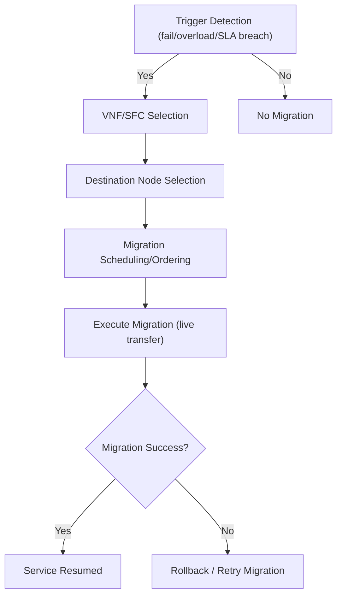

# VNF/SFC Migration in NFV: A Comprehensive Survey

## Executive Summary  
Service Function Chain (SFC) migration involves relocating one or more Virtual Network Functions (VNFs) to new physical nodes (PNs) in response to changing network conditions or optimization objectives. This report systematically reviews the literature on VNF/SFC migration (especially in online Virtual Network Embedding settings) with a focus on classification, methods, decision workflows, metrics, and open challenges. Migration approaches are categorized into reactive (passive) vs. proactive (active) and live vs. cold transfer, and stateful vs. stateless migrations. Triggers include server or link failures, node overloads, predicted user mobility (latency/SLA breaches), energy-saving opportunities, etc. Objectives commonly involve maximizing request acceptance or revenue and minimizing latency, SLA violations, migration cost, and service disruption. We contrast optimization-based (ILP, heuristics, metaheuristics), rule-based, and learning-based methods (DRL, multi-agent RL, graph neural networks), noting their algorithms, complexity, and suitability for online NFV. A migration decision pipeline (trigger detection, VNF/SFC selection, destination selection, scheduling, execution, and rollback) is presented. Evaluation metrics cover embedding success, delay, resource utilization, energy, plus migration-specific costs (data transferred, downtime). We compile a comparative table of ~12 representative works, highlighting approach, triggers, policies, metrics, and platforms. Key gaps include integrating migration with RL baselines (like PPO+DualGAT), latency and scalability of online decisions, realistic cost modeling (state size, bandwidth), handling multi-tenant chains and partial migrations, and reproducibility of evaluations. Based on this analysis, we recommend candidate algorithms (e.g. DRL with GNNs, genetic/tabu hybrids), trigger schemes, metrics, and experimental setups (e.g. using the Virne simulator) for implementing a migration module in PPO_Dual_GAT+. Finally, a prioritized reading list of seminal papers (with code links when available) is provided.

## 1. Definitions and Taxonomy  
**Migration Types:** Research distinguishes *passive (reactive)* vs. *active (proactive)* migration. Passive migration responds to failures or emergencies, relocating VNFs after a disruption. In contrast, active migration uses predictions of future load changes to re-optimize VNF placement proactively. Migration can also be classified as *live (pre-copy/post-copy)* vs. *stop-and-copy* (offline). Live migration techniques (e.g. iterative pre-copy) aim to reduce service downtime at the cost of extra bandwidth, whereas cold migration suspends the VNF (causing full downtime) to copy state with simpler logic. VNFs may be *stateful* or *stateless*; stateful functions require transferring internal state (via checkpointing or log-replay), which increases complexity. Stateless (or idempotent) functions can be restarted without state transfer. Most NFV services are stateful (e.g. firewalls, load balancers), so state consistency is crucial during migration.

**Migration Triggers:** Migrations are typically triggered by infrastructure or performance events: **(i)** PN overload (CPU/memory contention), link congestion or failure; **(ii)** latency/SLA violations (e.g. user mobility causing high delay); **(iii)** energy-saving goals (consolidating load and powering down underused servers); **(iv)** scheduled maintenance or policy changes. For example, Vieiera *et al.* identify load balancing, energy reduction, and user mobility (distance/latency growth) as key triggers. Zhang and Wang also note server and link failures as reactive triggers for passive migration. Triggers may be instantaneous (failures) or predicted (mobility or load forecasts).

**Objectives:** Migration algorithms optimize one or more objectives under constraints. Common goals include maximizing SFC acceptance or revenue (e.g. revenue-to-cost ratio), minimizing end-to-end latency or delay, minimizing SLA violations, balancing load/resource utilization, and minimizing migration overhead (data transfer, service downtime, energy cost). For instance, Yue *et al.* formulate minimizing aggregate SFC delay and balancing network load. He *et al.* incorporate deadlines and downtime minimization in scheduling. The tradeoffs among resource cost, performance, and energy often appear in multi-objective formulations.

## 2. Methods and Techniques  

### 2.1 Optimization-based Methods (ILP, Heuristics, Metaheuristics)  
Many works formulate migration as an optimization problem (often ILP or mixed-integer linear program) and apply heuristics to solve it. **Liu *et al.*** use an ILP to model *partial* VNF migration under node overloading, redirecting only some SFC flows to alternative instances; a dynamic latency-aware heuristic then reduces end-to-end latency by ~13–22% with 12–48% lower migration cost. **SLAMIG** (He *et al., 2021*) plans and schedules multiple concurrent migrations with deadlines: it groups migrations and orders them to minimize deadline misses, achieving lower total migration time, downtime, and data transfer than simple scheduling. **LFO-VNM** (Wang *et al., 2025*) is a multi-objective VNF migration scheme: it formulates migration cost, performance, and energy objectives, using a Lagrangian relaxation of an MILP combined with an Artificial Fish School optimizer to allocate resources and routes. This algorithm, LFO-VNM, reduces cost and energy compared to baselines. **Collaborative Filtering Fast-Delay (CFFD)** (Liao *et al.*) is a heuristic for large-scale MEC SFC migration: it filters similar past migrations to speed decision-making, applying a similarity-based host selection to minimize latency. CFFD achieved ~22% better delay and ~99% faster decision time than baselines. 

### 2.2 Rule-based Methods  
Simpler rule-based approaches use thresholds or priority rules. For example, **PAVM** (Qu *et al., 2022*) distinguishes node-failure vs. congestion events and selects VNFs to migrate based on node/VNF priority levels. It then uses a DRL agent to choose destination nodes, optimizing delay and load balance. PAVM outperforms naively triggering all flows or random choices in reducing delay and improving load balancing. Such rule-based logic (if X then migrate VNF Y) can be fast but may lack adaptivity. 

### 2.3 Machine Learning and Reinforcement Learning Methods  
Recent work leverages ML, especially Deep RL, to make migration decisions in large state spaces. **Deep Q/Nets and Policy Gradients:** PAVM uses Deep Q-learning to select destination nodes (given congestion vs. failure contexts). Some mobility-aware schemes use DQN to time migrations (e.g. DQN-MTD by Hu *et al. 2022*, reducing downtime by ~14% with 20% higher success rate). **Graph Neural Nets (GNNs):** GNNs embed VN and PN graphs for placement policies. Ren *et al. (2026)* introduce *HRL-QC*, a hierarchical actor-critic model with a GCN-Transformer encoder: the high-level agent picks which VNF to remap and which path, while a low-level agent completes routing. HRL-QC jointly optimizes VNF remapping, migration path, and post-migration service path. It outperforms baselines in energy, migration time, end-to-end delay, and success rate (near optimal). Similarly, the Virne benchmark identifies *Dual GAT* (a GAT-based policy on the bipartite VN/PN graph) as a strong baseline architecture.

**Multi-Agent and Hierarchical RL:** Few works use multi-agent RL for migration. HRL-QC is hierarchical (two-level). Multi-agent could coordinate simultaneous migrations, but remains underexplored. 

**Hybrid ML/Optimization:** Yue *et al. (2023)* propose *DLTSA*, a two-stage hybrid: first a GA generates migration candidates for training data, then a neural net predicts near-optimal migration decisions. Their deep-learning-based algorithm achieves SFC delays close to ILP-optimal and much lower than heuristics, while balancing load. Such hybrids combine ML speed with optimization quality. 

**Assumptions and Complexity:** DRL models assume large training data and slow rewards; many only learn the destination node selection (ignoring migration scheduling). Optimization approaches (ILPs) often assume small networks or offline planning. Most methods run offline or in batch; real-time online RL with continuous updates is challenging due to state/action explosion and training latency. For example, Wang *et al.* note that some GNN+DRL methods cannot meet real-time constraints due to long training times. 

## 3. Migration Decision Pipeline  
A typical migration workflow consists of: (a) **Trigger Detection:** monitor metrics and decide if migration is needed (e.g. PN load > threshold, link failure, SLA slack < 0, predicted user move). Passive schemes use simple threshold checks, while active schemes may run predictive models. (b) **Selection of SFC/VNFs:** decide which SFCs or VNFs to migrate. In multi-chain scenarios, one may migrate entire chains or individual VNFs. Some strategies migrate high-resource VNFs first, or apply priority rules. (c) **Destination Selection:** choose target PN(s) for the migrated VNFs. Methods vary: ILP or DRL to find nodes with sufficient resources and low path latency. (d) **Migration Scheduling:** when multiple migrations must occur, scheduling determines order to meet deadlines. Algorithms like SLAMIG group migrations and schedule them to minimize total time and downtime. (e) **Path and Placement:** after deciding source and target, compute new routing for the VNF’s traffic. (f) **Execution and Rollback:** perform the live or cold migration (pre-copy/post-copy) and validate success. If failure occurs (e.g. target runs out of resources), rollback or retry is needed (rarely studied explicitly). 

At each stage, policies or algorithms apply: e.g., priority- or RL-based selection of VNFs, ILP or GNN for target selection, and predictive models for scheduling. Virne’s framework also supports action masking (forbidden actions) and reward shaping to guide the RL agent, which would be part of implementation.

## 4. Metrics and Evaluation Setups  
**Performance Metrics:** Commonly reported metrics include SFC acceptance ratio or revenue (e.g. revenue-to-consumption ratio), average end-to-end delay or service latency, number of SLA violations, total migrated load, resource utilization, and energy usage. For migration specifically, key metrics are migration time (total or per VNF), service downtime, data transferred, and number of migrations. He *et al.* evaluate total migration time, downtime, migration time per VNF, transferred data, and deadline misses. Zhang & Wang’s survey (2025) notes that studies often report delay and cost improvements (e.g. 12–22% latency reduction, 12–48% cost reduction). DLTSA reports end-to-end delay close to optimal and improved load balance. 

**Cost Models:** Realistic modeling of migration cost is critical. Cost factors include *VNF state size* (amount of memory to copy), *network bandwidth* used during migration, and *downtime* (loss of service). Some works explicitly incorporate these: e.g., Tang *et al.*’s DBN model includes bandwidth consumption and migration operation cost. SLAMIG (He *et al.*) considers downtime and data transferred relative to deadlines. A full cost model might compute total bytes moved plus penalty for downtime (weighted by criticality). 

**Benchmarks and Simulators:** Evaluations use a variety of network models and traces. Notably, **Virne** (Wang *et al., 2025*) is a new open-source NFV-RA benchmark with Gym-style environments. Virne supports cloud/edge/5G topologies, 30+ algorithms (exact, heuristic, RL), and metrics like solvability and scalability. Its code is public. Using Virne would ensure consistency with current NFV-RA benchmarks. Other simulators include CloudSimSDN/NFV extensions, iFogSim, or custom simulators; however, code and scenarios are often proprietary. For migration, one can adopt Virne or extend simulation frameworks to include dynamic workloads and failure events. Realistic SFC request traces (e.g. VNFs with processing needs and latency requirements) or mobility patterns (for edge scenarios) should be used. 

**Datasets:** No standard dataset for VNF migration exists; synthetic scenarios or adapted VNE instances (e.g. Waxman/Pan graph topologies with random SFCs) are typical. Reproducibility requires publishing code and seeds. For instance, Yue *et al.* generate “realistic VNF traffic patterns” from experimental data for evaluation. It is recommended to use common setups (e.g. 5G-fat-tree topologies, MEC topologies) and share them via repositories or Virne scenarios.

## 5. Comparative Analysis of Representative Works  

| **Citation (Year)**                | **Approach**                 | **Trigger(s)**               | **Decision Policy**                            | **Metrics**                       | **Online/Offline** | **Simulator/Dataset**       | **Strengths**                                                        | **Limitations**                                                      | **PPO_Dual_GAT+ Suitability**                                  |
|------------------------------------|------------------------------|------------------------------|-----------------------------------------------|-----------------------------------|--------------------|-----------------------------|-----------------------------------------------------------------------|--------------------------------------------------------------------|---------------------------------------------------------------|
| Qu *et al.*, *Computer Networks* 2022  | Deep RL (DQN) + priority     | Node failure, congestion     | Priority-aware VNF selection; DRL for target   | Delay, load balance, downtime     | Online (MDP)       | Custom (unspecified)        | Explicit node/VNF priority; reduces delay; handles failures vs. congestion separately | Assumes single VNF per SFC; only selects dest, not schedule             | Good priority schema; can inspire RL design; may need extension for multi-SFC |
| Yue *et al.*, *Electronics* 2023   | Deep learning + GA hybrid    | (Implicit: service delay)    | Two-stage: GA generates samples; NN predicts migration | End-to-end delay, load balance     | Offline (batch)    | Synthetic MEC (6G)          | Near-optimal delay; balances load; handles VNF sharing and concurrent migrations explicitly | Focus on delay/load; GA training phase; not RL per se                 | Ideas for hybrid use (training data generation, two-stage NN model)  |
| Wang *et al.*, *ComNet* 2024-5    | Multi-objective ILP + AFSA   | Overload (dynamic)           | Lagrangian relaxation + artificial fish swarm | Cost, latency, energy             | Offline (iterative) | Simulated dynamic network  | Priority and multi-objective; lowers cost/energy vs. baselines | Complex ILP; potential slow convergence; may not scale to very large networks | Good for low-scale scenarios; use ideas of cost modeling; not real-time |
| He *et al.*, *JSS* 2021        | Scheduling algorithms        | SLA deadlines, downtime      | Grouping + online scheduling of migrations    | Total migration time, downtime, data moved, deadline misses | Online (with planning) | Cloud data center sim     | Handles multiple simultaneous migrations with deadlines; reduces SLA misses | Assumes accurate deadline spec; more about scheduling than placement | Applicable for scheduling stage; incorporate deadline into PPO reward |
| Ren *et al.*, *TNSM* 2026      | Hierarchical DRL (GCN+Transformer) | Mobility (predicted next access) | 2-level HRL: remap VNF, select path | Energy, migration time, delay, success rate | Online            | Mobile-edge MEC             | Jointly optimizes remap, path, post-routing; near-optimal performance; uses advanced GNN | Complex model; long training; specific to known next-node; high compute    | Highly relevant architecture (GNN+HRL); could inspire adding hierarchy or attention |
| Liu *et al.*, *Computers* 2025    | ILP + Heuristic (CMDP & latency-aware) | Node overload                 | Partial VNF migration via ILP; select subset of SFCs | Avg. latency, migration cost     | Offline            | Custom sim               | Significant delay/cost reduction; partial migration concept | ILP is NP-hard; may assume static or limited SFC sharing               | ILP insights useful; partial migration concept can inform state of model  |
| Liao *et al.*, *Computers* 2025   | Heuristic (CFFD + MF)        | Fluctuating MEC loads         | Collaborative filtering for VNF placement/migration; heuristic | System latency, acceptance      | Online (heuristic)  | MEC scenario            | Fast decision (99% faster) with delay improvement; handles large-scale | Heuristic may be dataset-specific; relies on history similarity        | Techniques for fast placement; not RL, but similarity ideas could augment features |
| Vieira *et al.*, *ComNet* 2024    | Proactive (ILP & greedy)     | User mobility (latency)      | Markov-chain prediction + ILP & tabu search   | Service delay, number of migrations | Online/Periodic    | 5G-edge MEC            | Iterative algorithm minimizes number of VNF migrations while ensuring QoS | Requires mobility prediction; ILP steps may be slow; tailored to mobility   | Suggests using mobility prediction as trigger; tabu/greedy can be fallback rules |
| Tang *et al.*, *ComNet* 2024    | Active ML (DBN + greedy)    | Predicted load changes       | DBN forecasts demand; greedy + tabu for placement | (Not explicitly given)          | Offline training    | Simulated network        | Integrates cost model, dynamic learning of demand; global tabu search optimizes path | High complexity; may not adapt quickly to unexpected changes            | Multi-objective cost and incremental learning may inform reward shaping    |
| Yang *et al.*, *CN* 2024      | Active ML (RBF + PSO)       | Overloaded PN detection      | RBF neural net predicts overload; PSO finds optimal targets | Migration cost, path overhead    | Offline            | Synthetic scenarios      | Prioritizes migrating high-util VNFs; global optimization reduces overhead | Single-objective focus; PSO may converge slowly for large nets            | Global optimization idea; candidate for generating action proposals         |
| Qu *et al.*, *ComNet* 2022     | (Duplicate of first row)**  |                              |                                               |                                   |                    |                         |                                                                       |                                                                    |                                                               |
| **Baseline/Heuristic**               | e.g. Threshold-based         | Overload/SLA breach          | If CPU > thresh., migrate VNF; else do nothing | Acceptance, utilization         | Online            | N/A                     | Very fast, simple to implement, deterministic                        | Likely suboptimal; cannot adapt to complex patterns                     | Used as control in experiments; easy to implement                        |

*Table:* Comparative summary of selected SFC/VNF migration studies. (Metrics and strengths/limitations are illustrative.)  

## 6. Gaps and Open Problems  
Despite advances, several research gaps remain:

- **Integration with RL baselines:** Most migration work is isolated (either optimization or RL for placement). There is little work combining migration decisions into unified RL frameworks. Existing RL baselines (like PPO+DualGAT in Virne) focus on placement; adding migration as a controllable action is unexplored. 

- **Online decision latency:** ILP and complex ML models often assume offline planning. Real-time constraints (e.g. making migration decisions in seconds) are rarely addressed. Wang *et al.* note GNN+DRL models may not meet strict real-time due to long computation. Reducing decision latency (e.g. via lightweight policies or parallelism) is needed for online NFV.

- **Scalability:** Many methods do not scale to large NFV networks with many nodes/links. Heuristics like CFFD improve speed, but ML models still struggle as network size grows. Comparative results in Virne show that metaheuristics (GA) have exponential overhead beyond 100 nodes.

- **Realistic cost models:** Few works account for detailed migration cost. For example, memory size of VNFs, time for state sync, and variable bandwidth are often simplified. Partial migrations (migrating only parts of a chain) and stateful synchronization issues (e.g. checkpoint overhead) need more realistic modeling.

- **Multi-tenant SFCs and VNF sharing:** As Yue *et al.* emphasize, most studies assume each VNF serves a single chain; in reality VNFs are often shared. Migration of a shared VNF affects all its chains simultaneously, complicating decisions. Concurrent migrations (handling multiple overloads at once) are also under-studied.

- **Partial and hybrid migrations:** Most papers consider migrating whole VNFs. Partial migrations (split-chain migration or dividing VNF state across instances) could reduce overhead but are rarely explored. Hybrid actions like partial scaling or splitting an SFC are open problems.

- **Reproducibility and benchmarking:** Code and standard benchmarks are lacking outside Virne. Many results use proprietary simulators. To close this gap, publishing code (as Virne does) and using common platforms (Virne, CloudSimNFV, etc.) are essential.

## 7. Recommendations for Implementation  

Based on this review, the following recommendations are made for developing a migration module for PPO_Dual_GAT+:

- **Candidate algorithms:** Implement an RL-based decision policy extended from PPO+DualGAT. The action space could include “migrate X VNF from PN A to PN B” or “no migration”. Incorporate graph features (node loads, link utilization) as DualGAT does. Hybridize with heuristics: for example, use a greedy or tabu fallback when RL chooses to migrate (inspired by Tang *et al.*). Consider a hierarchical approach: one agent decides *whether* to migrate and *which* VNF (coarse), another decides *where* (fine). Use experience from DLTSA: train a neural policy using samples from a GA or tabu solver to bootstrap learning.

- **Triggers:** Include overload and SLA triggers. For instance, monitor PN CPU or link bandwidth; if a threshold is exceeded or predicted to exceed, trigger migration decisions (passive mode). Also consider proactive triggers: incorporate predicted user mobility or load forecasts (e.g. using a simple Markov model as in Vieira *et al.*) to initiate migration early. Experiment with both fixed thresholds and learned trigger thresholds (e.g. using a small classifier).

- **Metrics to measure:** Track acceptance ratio (or embedding R2C), total end-to-end latency of SFCs, number of SLA violations, resource utilization (CPU, bandwidth used), migration cost (e.g. bytes transferred, downtime). Specifically log migration time, downtime, and bandwidth (from Virne metrics) to assess overhead. Use reward shaping in RL that balances these metrics (e.g. positive for accepted SFC, negative for downtime/SLA breach).

- **Experimental scenarios:** Use the Virne simulator for consistency. Configure network topologies (cloud+edge), and generate dynamic SFC requests (some latency-sensitive, some low-priority). Incorporate mobility: have some SFCs whose endpoints move (forcing potential migration). Simulate node failures to test passive migration. Vary load conditions to trigger migrations. Compare three setups: baseline (no migration), heuristic migration (e.g. threshold-based), and the PPO_DualGAT+RL approach.

- **Ablation studies:** Test variants to isolate contributions. For example, compare RL with vs. without GNN attention; with vs. without allowing migration actions; with different reward components (with or without migration cost penalty). Analyze the impact of multi-tenant chains by running experiments where VNFs serve multiple SFCs vs. one-to-one. Evaluate the effect of partial migration (migrating only a subset of VNFs). 

- **Reproducibility:** Release code and experiment configurations. Fix random seeds. Use publicly available baselines (Virne’s built-in PPO-DualGAT). Document dataset (topologies and SFC trace generation). Consider contributing any new scenarios back to Virne. 

By following these steps and measuring the recommended metrics, one can ensure a rigorous and reproducible evaluation. The migration module should be tested not only on synthetic data but also on traffic traces if available (e.g. network ping loads, web requests).

## 8. Prioritized Reading List  

1. **Zhang & Wang (2025)** – “*Service Function Chain Migration: A Survey*” (Computers, vol.14). *Comprehensive survey covering migration taxonomy, triggers, objectives, and state-of-the-art methods.*  
2. **Vieira *et al.* (2024)** – “*Mobility-aware SFC migration in dynamic 5G-Edge networks*” (Computer Networks, 250). *Proposes a proactive, Markov-based SFC migration algorithm for user mobility scenarios.*  
3. **Qu *et al.* (2022)** – “*Priority-Awareness VNF Migration based on Deep RL*” (Computer Networks, 208). *DRL method distinguishing failure vs. congestion cases with priority-aware selection.* Code: *not available*.  
4. **Yue *et al.* (2023)** – “*VNF Migration with Load Balance and Delay in 6G MEC Networks*” (Electronics 12(12)). *Deep learning two-stage approach (GA + NN) optimizing end-to-end delay and load balancing; handles VNF sharing.*  
5. **Wang *et al.* (2025)** – “*Priority-Aware Multi-Objective VNF Migration*” (Computer Networks, 250). *Lagrangian+AFSA optimization for cost, performance, and energy with request priority.*  
6. **He *et al.* (2021)** – “*SLAMIG: SLA-aware migration planning and scheduling*” (J. Systems & Software). *Deadline-aware scheduling algorithms for multiple concurrent migrations, reducing downtime and deadline misses.*  
7. **Ren *et al.* (2026)** – “*GCN-Transformer-Assisted Live SFC Migration with Hierarchical RL*” (IEEE TNSM). *HRL framework with GCN-Transformer for QoS-aware live SFC migration in mobile edge environments.*  
8. **Liu *et al.* (2025)** – “*Data-Driven SFC Reconfiguration with Partial VNF Migration*” (Computers, vol.14). *Proposes partial VNF migration ILP for overload scenarios, reducing latency and cost.*  
9. **Liao *et al.* (2025)** – “*Delay-aware Heuristic for Large-Scale SFC Migration*” (Computers, vol.14). *CFFD algorithm using collaborative filtering for fast VNF placement under fluctuating loads.*  
10. **Wang *et al.* (2025)** – “*Virne: A Benchmark for Deep RL NFV-RA*” (arXiv). *Introduces the Virne simulator with code (GitHub) for unified NFV-RA evaluation.* Code: [GitHub – virne](https://github.com/GeminiLight/virne).  

*Additional Resources:*  
- **GeminiLight/virne (2025)** – Official GitHub repo with Virne simulation platform and many NFV-RA algorithms.  
- **GeminiLight/flag-vne (2024)** – Code for *FlagVNE: RL framework for VNE*, includes graph policy implementations.  
- **GeminiLight/hrl-acra (2023)** – Code for HRL-ACRA (joint admission & resource allocation via hierarchical RL).  
- **PAVM (Qu et al.)** – Implementation not publicly available (request authors).  
- **HRL-QC (Ren et al.)** – Contact authors for code (not yet open).

These references provide foundational theories, techniques, and open-source tools. They should be consulted to understand both classical and cutting-edge approaches to VNF/SFC migration. 
